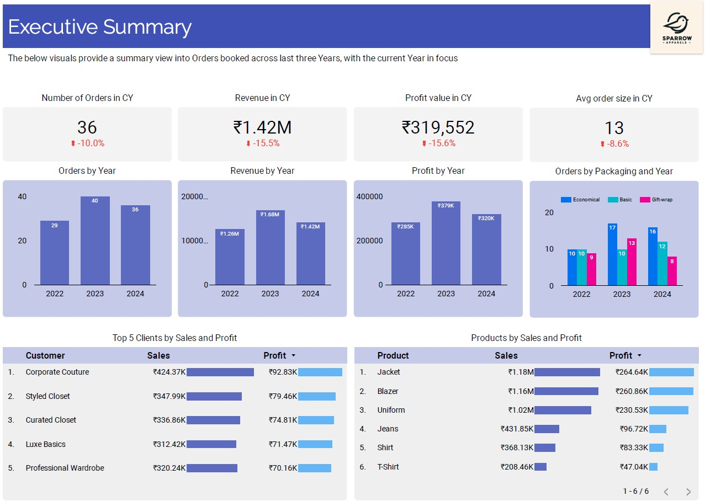

# Sparrow Apparels Order Analysis Project

This project analyzes order data from a small Apparel firm that records data in Google Sheets, stored and processed in BigQuery, and visualized using Looker

## Data Sources

*   Google Sheets (for initial data entry)
*   Google BigQuery (for data storage and processing)

## Tools Used

*   Google Sheets
*   Google BigQuery
*   Looker
  
## Assumptions

* The cost of materials, packaging and manhour was kept constant
* Each order has only a specific type of Product associated with it
* Production cost means - cost of material required to fulfill an order, manhour cost to complete all process and cost of packaging material
* Total working days are 24 and that consists of 8 hrs of working each day
* The firm uses discounts for high volume orders depending on order volume, for anything above 40 items the profit margin is 27.5% while below that is 30%

## Business Questions Addressed

* Number of Orders and items by time frame - Month, Qtr, Year
* Number of Orders and items by Clients, Product Type, size, Packaging
* What is the average order size and average order value for each client?
* How much would be the cost price (production+packaging) for each Product type?
* What is the Profit by Order, by Product type, by Client?
* How much man hour was consumed each month for orders booked in the same month?
* A brief analysis on rejected orders

## Key Findings

* Spparow Apparels saw a decline in it's orders and revenue as compared to year 2023, majorly driven by fewer Blazer, Uniform and Jeans orders
* The top 2 Customers orders saw a 60-80% decline as compared to last year
* Year 2024 saw the highest ever Shirt ordered, which resulted in a 90% more revenue for shirts as compared to last year

